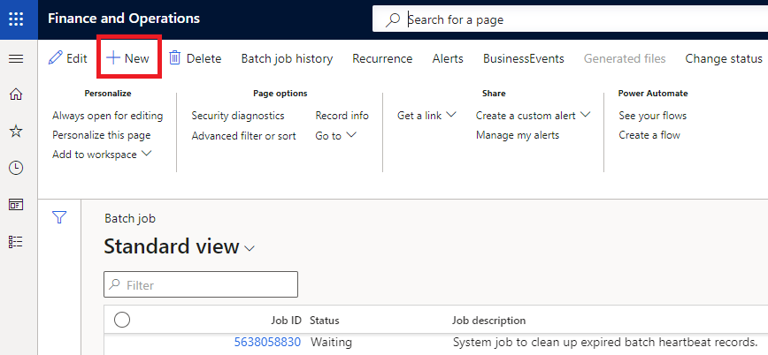
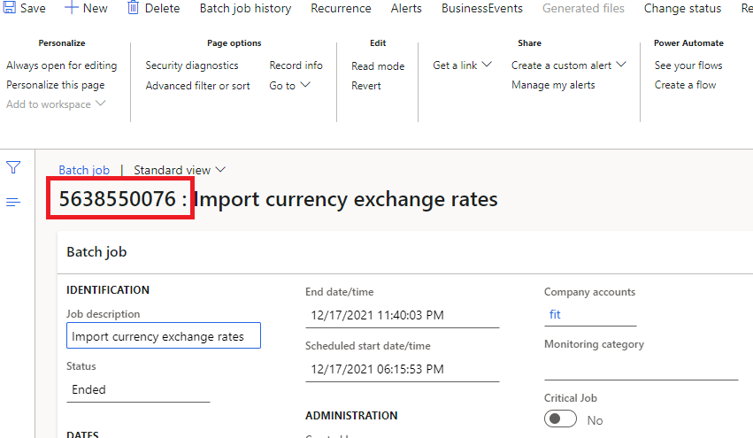
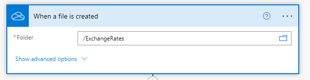
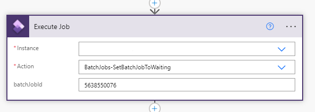
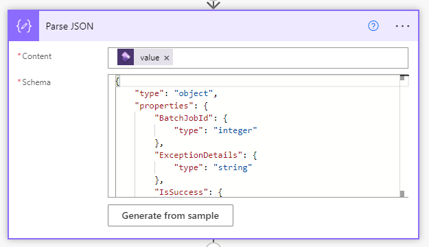
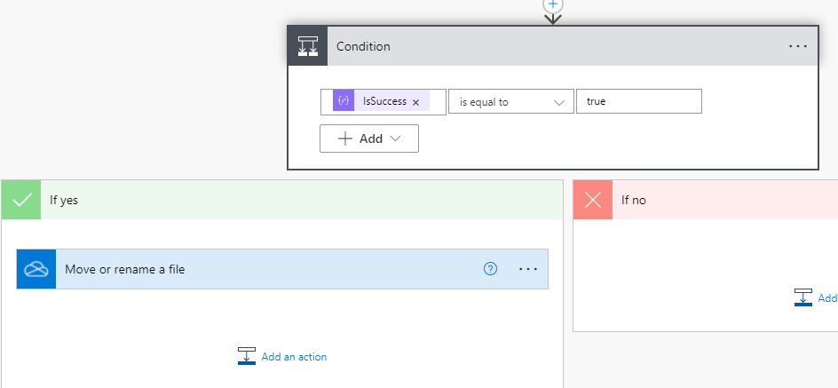
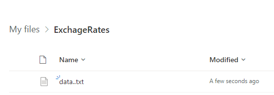
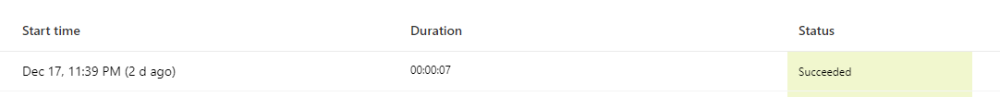
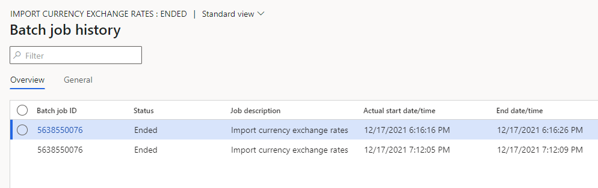

D365 Finance & Operations version 10.0.22 introduced a new API, the Batch OData API. This API allows you to requeue batch jobs from Power Automate or other external applications. You can find more details about this feature in the Microsoft documentation Microsoft Docs [https://docs.microsoft.com/en-us/dynamics365/fin-ops-core/dev-itpro/get-started/whats-new-platform-updates-10-0-22](https://docs.microsoft.com/en-us/dynamics365/fin-ops-core/dev-itpro/get-started/whats-new-platform-updates-10-0-22).

It's important to note that only batch jobs in a terminal state can be requeued.

By leveraging this new functionality, we can use Power Automate to trigger the resubmission of failed or cancelled batch jobs.

## Requirement

A custom exchange rate provider in Dynamics 365 depends on exchange rates data file exported from an external system. The ability to retrieve exchange rates from an external service even the system does not provide an exact timeframe to export data.

## Resolution approach

One approach might involve scheduling a batch job to run several times a day. However, this is inefficient, as it could lead to unnecessary executions if the file isn't always available in the Microsoft OneDrive folder.

Therefore, a better approach for this scenario would be to execute the batch job only when the file is actually available.

## Configuration

Open Batch jobs ( System Administration > Inquiries > Batch jobs ). Create a new batch job by pressing “New”.

Fill in all required information ( Description, Batch, tasks, etc. ). Select “Save” and take note of Batch job id.

## Power Automate

Using Power Automate, we can create a trigger that fires whenever a file is created in a specific Microsoft OneDrive folder called "ExchangeRates."

Create an action to Dynamics 365 Finance & Operations.

1. Fill in instance Url.
2. In Action select "BatchJobs-SetBatchJobToWaiting".
3. batchJobId is Dynamics 365 Finance & Operations Batch Job Id that was created in the previous step.

Create a Parse Json action to handle answer values.

Create a condition to confirm if the Batch job was requeue successfully by checking IsSuccess value output. A success value confirms that the job was set to a waiting state and not that it executed without errors.

Save and active Power Automate Flow.

## Simulation

Now let's validate the whole process.

1. Drop a file in OneDrive that triggers flow from Power Automate Flow.

    

2. Check Power Automate Flow Run Execution history

    

3. Open Batch Job History and confirm that Batch job was executed.

    

> Photo by [Minku Kang](https://unsplash.com/@minkus) on [Unsplash](https://unsplash.com/)
