Following a database transfer in Dynamics 365 Finance, custom routines or scripts are routinely executed to update configurations, anonymize sensitive data, etc.
For instance, following a production database being copied to a sandbox environment in Dynamics 365 Finance, it may be necessary to anonymize specific tables or remove configurations to reflect the nature of the non-production environment.

To implement this dynamic behavior or even block the execution if erratically is deployed in production. We need dynamically determine the environment to execute proper actions ( Production, Sandbox, etc.)

This article aims to explore the identification of the environment within Dynamics 365 Finance using X++. We will achieve this by querying Lifecycle Services (LCS) to retrieve the environment type where the code is currently executing.

Dynamics 365 Finance and Operations applications leverage Lifecycle Services (LCS), a Microsoft Dynamics portal, for managing implementations. LCS provides a REST API that facilitates querying environment metadata. However, this REST service is subject to a rate limit. As of the time of writing, LCS restricts usage to a maximum of 6 calls per minute. Consequently, frequent calls from routines are not advisable.  

## Setting app registration

The first step is to create an app registration on Azure Active Directory.

1. Open Azure Portal located in [https://portal.azure.com/](https://portal.azure.com/)
2. Select the Azure Active Directory service.

    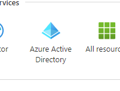

3. Select App registrations.

    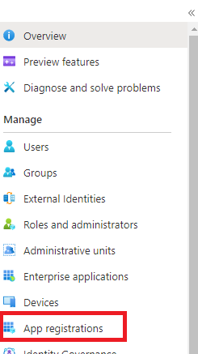

4. Select "New registration"

    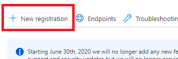

5. Enter a new Name and register the app.

    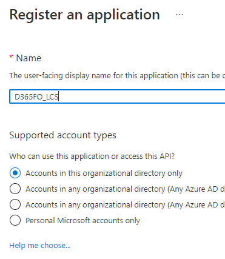

6. Select "API permissions".

    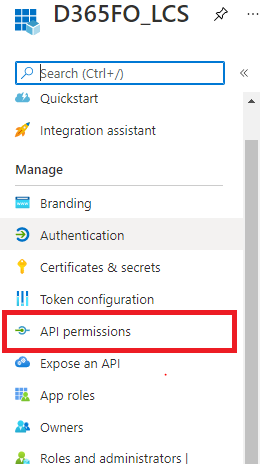

7. Select "Add a permission".

    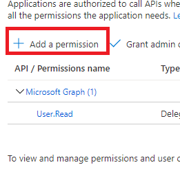

8. Search for Dynamics Lifecycle services and add the user_impersonation permission to your app.

    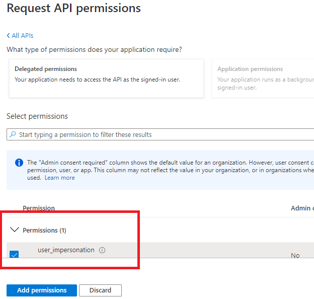

9. Select Certificates & secrets and define a new secret value for authentification.

    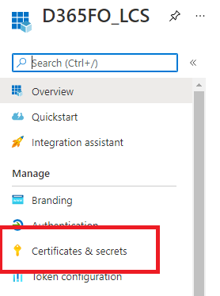

## API using Postman

The next step, execute a simple test with the postman to validate that requests are successful.

1. Create a Post Request. Define variables according to your environment. After successfully generating credentials, copy the "access_token" value to reuse in the next step.

    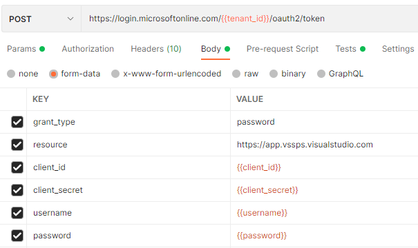

2. Create a Get Request to <https://lcsapi.lcs.dynamics.com/environmentinfo/v1/detail/project/{projectId}/?environmentId={environmentId}>.

        Replace projectId and environmentId from LCS values.

3. Paste token value from step 1.

    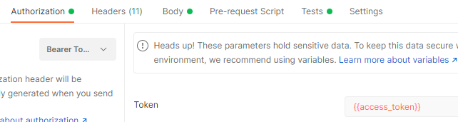

4. Define mandatory and fixed values of request.

    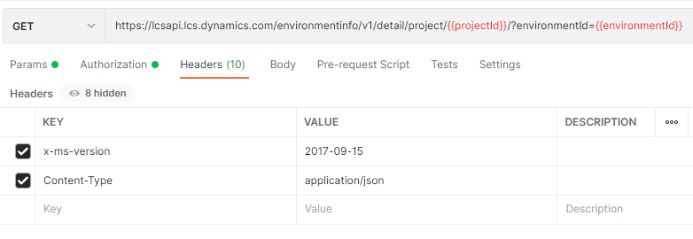

5. After submitting the request, you should get a similar JSON answer. The values that we need for now are IsSuccess and EnvironmentType.

````json
{
    "ResultPageCurrent": 1,
    "ResultHasMorePages": true,
    "Data": [
        {
            "EnvironmentId": "d15ed3a2c2c140547740b946c43915da3",
            "EnvironmentName": "MainProdEnv",
            "ProjectId": 123456,
            "EnvironmentInfrastructure": "MicrosoftManaged",
            "EnvironmentType": "Production",
        ......
        }
    ],
    "IsSuccess": true,
}
````

## Implementing in X++

Define simple utility functions to get current environment info.

````csharp
{
    /// <summary>
    /// get the environment information
    /// </summary>
    /// <returns></returns>
    private static IApplicationEnvironment getEnvironment()
    {
        return EnvironmentFactory::GetApplicationEnvironment();
    }

    /// <summary>
    /// get the tenant id
    /// </summary>
    /// <returns>tenant id</returns>
    private static str getTenantId()
    {
        IApplicationEnvironment appEnvironment = LCSApiDemo::getEnvironment();
        return appEnvironment.Aad.TenantDomainGUID;
    }

    /// <summary>
    /// Gets the value for the lcs api endpoint setting from configuration
    /// </summary>
    /// <returns>LCS API endpoint</returns>
    public static str getLcsApiEndpoint()
    {
        IApplicationEnvironment appEnvironment = LCSApiDemo::getEnvironment();
        return appEnvironment.LCS.LCSAPIEndPoint;
    }

    /// <summary>
    /// get the environment id
    /// </summary>
    /// <returns>returns the environment id web config value if set or empty string if not set</returns>
    public static str getEnvironmentId()
    {
        IApplicationEnvironment appEnvironment = LCSApiDemo::getEnvironment();
        return appEnvironment.LCS.LCSEnvironmentId;
    }
}
````

Create a class to deserialize JSON answer from OAuth. The main property to get is access token.

````csharp
{
  /// <summary>
  /// OAuth Authentication Answer
  /// </summary>
  [DataContractAttribute]
  public class LCSAuthenticationToken
  {
      str accessToken;
      
      /// <summary>
      /// Authentication is successful
      /// </summary>
      /// <param name = "_accessToken"></param>
      /// <returns></returns>
      [DataMemberAttribute('access_token')]
      public str parmAccessToken(str _accessToken = accessToken)
      {
          accessToken = _accessToken;
          return accessToken;
      }

  }
}
````

Using [RestSharp](https://restsharp.dev) a popular library to handle REST API's we will execute our HTTP requests.

Out of the box, Postman can generate RestSharp code from a request by pressing "code". Let's adjust generated code to our needs.

````csharp
{
    /// <summary>
    /// Get the Azure AD token
    /// </summary>
    /// <param name = "_clientId">Application Id</param>
    /// <param name = "_secreat">Apllication secret</param>
    /// <param name = "_username"></param>
    /// <param name = "_password"></param>
    /// <returns>Azure AD token</returns>
    public LCSAuthenticationToken authentication(str _clientId, str _secreat, str _username, str _password)
    {
        str url = strFmt(authUrl, LCSApiDemo::getTenantId());
        
        RestClient restClient = new RestClient(url);

        RestRequest request = new RestRequest(Method::POST);
        request.AlwaysMultipartFormData = true;
        request.AddParameter('grant_type', 'password');
        request.AddParameter('client_id', _clientId);
        request.AddParameter('client_secret', _secreat);
        request.AddParameter('username', _username);
        request.AddParameter('password', _password);
        request.AddParameter('resource', LCSApiDemo::getLcsApiEndpoint());
        
        IRestResponse response = restClient.Execute(request);

        LCSAuthenticationToken token =  FormJsonSerializer::deserializeObject(classNum(LCSAuthenticationToken), response.Content);

        if (!token.parmAccessToken())
        {
            throw error("@ApplicationPlatform:OAuthCodeFailed");
        }

        return token;
    }
}
````

Implement contract classes to deserialize LCS environment info.

````csharp
{
  /// <summary>
  /// Environment request answer
  /// </summary>
  [DataContractAttribute]
  class LcsEnvironmentInfo
  {
      boolean isSuccess;
      List environments;
      
      /// <summary>
      /// if request was successful
      /// </summary>
      /// <param name = "_isSuccess"></param>
      /// <returns></returns>
      [DataMemberAttribute('IsSuccess')]
      public boolean parmAccessToken(boolean _isSuccess = isSuccess)
      {
          isSuccess = _isSuccess;
          return isSuccess;
      }

      /// <summary>
      /// Environment data rows
      /// </summary>
      /// <param name = "_environments"></param>
      /// <returns></returns>
      [DataMemberAttribute('Data'), DataCollectionAttribute(Types::Class, classStr(LCSEnvironmentData))]
      public List parmLines(List _environments = environments)
      {
          environments = _environments;
          return environments;
      }

  }

  /// <summary>
  /// LCS Dynamics 365 Finance Environment Detail
  /// </summary>
  [DataContractAttribute]
  class LCSEnvironmentDetail
  {
      str environmentId;
      str environmentType;

      /// <summary>
      /// LCS Environment Id
      /// </summary>
      /// <param name = "_environmentId"></param>
      /// <returns></returns>
      [DataMemberAttribute('environmentId')]
      public str paramEnvironmentId(str _environmentId = environmentId)
      {
          environmentId = _environmentId;
          return environmentId;
      }

      /// <summary>
      /// LCS Environment Type
      /// </summary>
      /// <param name = "_environmentType"></param>
      /// <returns></returns>
      [DataMemberAttribute('environmentType')]
      public str parmAccessToken(str _environmentType = environmentType)
      {
          environmentType = _environmentType;
          return environmentType;
      }

  }  
}
````

Again, using RestSharp. Execute HTTP request to get environment detail.

````csharp
{
    /// <summary>
    /// Get LCS Environment Info
    /// </summary>
    /// <param name = "_token">OAuth Token</param>
    /// <param name = "_projectId">LCS Projecct ID</param>
    /// <returns></returns>
    public LCSEnvironmentInfo getEnvironmentInfo(LCSAuthenticationToken _token, str _projectId)
    {
        str url = strFmt('%1/environmentinfo/v1/detail/project/%2/?environmentId=%3', 
            LCSApiDemo::getLcsApiEndpoint(),
            _projectId, 
            LCSApiDemo::getEnvironmentId());
        
        RestClient restClient = new RestClient(url);
        RestRequest request = new RestRequest(Method::GET);
        request.RequestFormat = RestSharp.DataFormat::Json;
        request.AddHeader("Content-Type", "application/json");
        request.AddHeader("x-ms-version", "2017-09-15");
        request.AddHeader("Authorization", "Bearer " + _token.parmAccessToken());

        IRestResponse response = restClient.Execute(request);

        LCSEnvironmentInfo envInfo =  FormJsonSerializer::deserializeObject(classNum(LCSEnvironmentInfo), response.Content);

        return envInfo;
    }
}

````

> Photo by [Luca Bravo](https://unsplash.com/@lucabravo) on [Unsplash](https://unsplash.com/)
