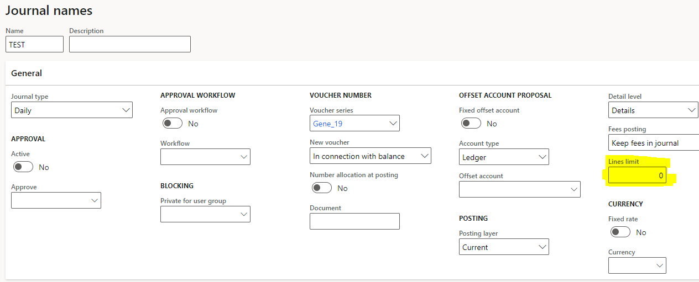
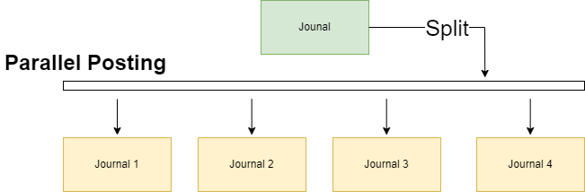

General Journals in Dynamics 365 were designed to handle large volume of rows. It's difficult to define exactly the baseline line to classify a journal as a large volume.

Our case was post journal **500 000** lines in a 6 hours time window. A performance throughput of roughly 1389 lines per minute during posting.

The absolute numbers can vary in production environments due to various factors, configurations, dimensions per line, etc.

## Baseline

First, let's define our baseline. Let's post a journal with 10,000 lines. The posting job took 50 minutes, translating to a performance of 200 lines per minute, which is significantly lower than expected.

## Configuration

To leverage parallel posting of general journals, we'll configure the 'Lines limit' field within the journal name setup. We'll then evaluate performance by simulating different scenarios with this value.

The 'Lines limit' setting distributes entries from a large journal into smaller journals based on the user-defined limit. These smaller journals may vary in size due to splitting rules, such as balancing by voucher (which groups related transactions together).  

Simplistic graphical representation of LedgerJournalPostBatch.  

First, we optimized settings on a single AOS Batch Server. The AOS was initially limited to processing 8 batch tasks simultaneously. During one test, we increased the limit to 12 tasks. However, surprisingly, performance decreased. This suggests that the AOS spent more time managing (or throttling) the increased number of tasks, reducing overall efficiency.

Post 10 000 lines, under a single AOS.

| Threads AOS | Number AOS | Lines to Post | Execution Time | Posting lines per Minute | Lines per Batch |
|-------------|------------|---------------|----------------|--------------------------|-----------------|
| 8           | 1          | 10 000        | 00:24:47       | 417                      | 1 0000          |
| 12          | 1          | 10 000        | 00:17:03       | 589                      | 500             |
| 8           | 1          | 10 000        | 00:16:19       | 625                      | 500             |

Post 10 000 lines, with multiple AOS.

| Threads AOS | Number AOS | Lines to Post | Execution Time | Posting lines per Minute | Lines per Batch |
|-------------|------------|---------------|----------------|--------------------------|-----------------|
| 8           | 4          | 10 000        | 00:07:39       | 1 429                    | 500             |

Post 50 000 lines, multiple AOS.

| Threads AOS | Number AOS | Lines to Post | Execution Time | Posting lines per Minute | Lines per Batch |
|-------------|------------|---------------|----------------|--------------------------|-----------------|
| 8           | 4          | 50 000        | 00:34:47       | 1 471                    | 250             |

All Values.

| Threads AOS | Number AOS | Lines to Post | Execution Time | Posting lines per Minute | Lines per Batch |
|-------------|------------|---------------|----------------|--------------------------|-----------------|
| 8           | 1          | 10 000        | 00:24:47       | 417                      | 1 0000          |
| 12          | 1          | 10 000        | 00:17:03       | 589                      | 500             |
| 8           | 1          | 10 000        | 00:16:19       | 625                      | 500             |
| 8           | 4          | 10 000        | 00:07:39       | 1 429                    | 500             |
| 8           | 4          | 50 000        | 00:34:47       | 1 471                    | 250             |

## Conclusion

By increasing the number of AOS and using smaller batches was possible to have a better throughout.

> Photo by [PAUL SMITH](https://unsplash.com/@sumo) on [Unsplash](https://unsplash.com/)